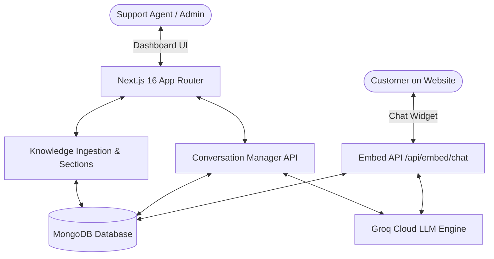

<div align="center">

  

  # ⚡ Assist IQ
  ### Next-Gen AI Customer Support & Autonomous Helpdesk Platform

  *Instantly resolve customer questions with an AI assistant that reads your docs, adheres to business boundaries, and speaks with empathy.*

  <p align="center">
    <a href="#-key-features">Features</a> •
    <a href="#-architecture--tech-stack">Tech Stack</a> •
    <a href="#-quick-start">Quick Start</a> •
    <a href="#-embeddable-widget">Widget Integration</a> •
    <a href="#-project-structure">Structure</a> •
    <a href="#-environment-variables">Environment</a>
  </p>

  <p align="center">
    
    
    
    
    
    
  </p>

</div>

---

## 🌟 Overview

**Assist IQ** is an enterprise-grade AI customer support platform designed to automate frontline customer service with extreme accuracy and lightning speed. By connecting your documentation, websites, and knowledge files, Assist IQ constructs an intelligent context engine that answers customer questions in real-time, escalates complex inquiries to human agents, and provides live analytics.

---

## ✨ Key Features

### 🧠 Intelligent Knowledge Engine
- **Multi-Source Ingestion**: Ingest knowledge directly from raw text, websites/URLs, markdown, and documentation.
- **Context Filtering**: Grounded answers using scoped knowledge chunks to eliminate hallucinations.
- **Automatic Sync**: Sync and update training data seamlessly from the dashboard.

### 🛡️ Guardrails & Topic Sections
- **Allowed & Blocked Boundaries**: Restrict AI responses strictly to designated business topics.
- **Configurable Fallback Behavior**: Gracefully redirect out-of-scope inquiries to human support.
- **Adaptive Personas**: Choose from multiple conversational tones: `Empathetic`, `Strict`, `Friendly`, or `Neutral`.

### 💬 Real-Time Live Support Inbox
- **3-Column Master-Detail View**: Track all active, escalated, and resolved customer threads in real-time.
- **Human Takeover**: Customer support agents can manually join threads and send instant replies.
- **AI Sentiment & Auto-Summaries**: Instant 1-click LLM analysis providing customer sentiment and bulleted conversation summaries.
- **Transcript Export**: Download full customer conversation histories as `.txt` files.

### 🧪 Interactive Simulator Playground
- **Live Sandbox**: Test bot responses, evaluate context retrieval, and test guardrail reactions.
- **Visual Customizer**: Preview brand colors, custom greetings, avatar logos, and response behaviors in real-time.

### 🌐 1-Line Embeddable Widget
- **Plug-and-Play**: Integrate Assist IQ into any website (WordPress, Shopify, Webflow, custom React/HTML) using a single asynchronous `<script>` tag.
- **Custom Theming**: Inherits your brand palette and configuration automatically.

### 📊 KPI Analytics & Health Score
- **Real-time Overview**: Track conversation volume, CSAT resolution rates, knowledge health scores, and active escalations.
- **Readiness Checklist**: Built-in assistant health score to guide you through optimal configuration.

---

## 🏗️ Architecture & Tech Stack



| Layer | Technologies |
|---|---|
| **Frontend Framework** | [Next.js 16](https://nextjs.org/) (App Router), [React 19](https://react.dev/) |
| **Styling & Icons** | [Tailwind CSS v4](https://tailwindcss.com/), [Lucide Icons](https://lucide.dev/) |
| **Language & Typings** | [TypeScript](https://www.typescriptlang.org/) |
| **AI Inference** | [Groq Cloud SDK](https://console.groq.com/) (Qwen, Llama 3 models) |
| **Database & ODM** | [MongoDB](https://www.mongodb.com/) via [Mongoose](https://mongoosejs.com/) |
| **Content Scraping** | [Cheerio](https://cheerio.js.org/) |

---

## 🚀 Quick Start

### 1. Prerequisites
- **Node.js**: `v18.17.0` or higher
- **npm**, **pnpm**, or **yarn**
- A **MongoDB** database URI (local or [MongoDB Atlas](https://www.mongodb.com/cloud/atlas))
- A free **Groq API Key** from [console.groq.com](https://console.groq.com/)

### 2. Clone the Repository
```bash
git clone https://github.com/Shubhampanchal108/oneminute-support.git
cd oneminute-support
```

### 3. Install Dependencies
```bash
npm install
```

### 4. Configure Environment Variables
Create a `.env` file in the root directory and populate the required variables:

```env
# MongoDB Connection
MONGO_URI=mongodb+srv://<username>:<password>@cluster0.mongodb.net/customer-support-bot?retryWrites=true&w=majority

# Groq Cloud AI API Key
GROQ_API_KEY=gsk_your_groq_api_key_here

# App URL
NEXT_PUBLIC_APP_URL=http://localhost:3000
```

### 5. Start the Development Server
```bash
npm run dev
```

Open [http://localhost:3000](http://localhost:3000) in your browser.

---

## 🔌 Embeddable Widget

Deploy Assist IQ to any external website with a single snippet placed before the closing `</body>` tag:

```html
<script 
  src="https://your-domain.com/api/embed/widget.js" 
  data-bot-id="YOUR_BOT_ID" 
  async>
</script>
```

The script automatically injects an empathetic, responsive floating chat interface that syncs with your business metadata and knowledge base.

---

## 📁 Project Structure

```
├── app/
│   ├── api/
│   │   ├── chatbot/chat/       # Chatbot engine & prompt routing
│   │   ├── conversations/      # Real-time threads, human reply, AI summaries
│   │   ├── dashboard/stats/    # KPI metrics aggregation
│   │   ├── embed/              # External embeddable widget & API
│   │   ├── knowledge/          # Scraper & knowledge ingestion
│   │   └── metadata/           # Business setup & branding configuration
│   ├── dashboard/
│   │   ├── page.tsx            # Main overview & KPI dashboard
│   │   ├── chatbot/            # Interactive testing playground
│   │   ├── conversation/       # Live customer conversation inbox
│   │   ├── knowledge/          # Knowledge source management
│   │   ├── sections/           # Topic guardrails & scope definitions
│   │   └── settings/           # Business branding & bot customization
│   ├── embed/chat/             # Widget iframe viewer
│   ├── layout.tsx              # Root app layout
│   └── page.tsx                # Landing page
├── components/
│   ├── dashboard/              # Dashboard shells, collapsible sidebar, KPIs
│   │   ├── conversation/       # Thread viewer, list, & AI summary components
│   │   ├── overview/           # KPI cards, activity feed, readiness checklist
│   │   └── chatbot/            # Live chat simulator & settings editor
│   └── ui/                     # Primitive UI components (buttons, badges, cards)
├── Database/
│   ├── db.ts                   # MongoDB connection client
│   └── models/                 # Mongoose schemas (Conversation, Knowledge, Metadata)
├── lib/
│   ├── llm.ts                  # Groq AI completion client & summary utilities
│   └── utils.ts                # Class merge & formatting helpers
└── public/                     # Static assets (logos, icons)
```

---

## 🔒 Security & Privacy
- **Identity Isolation**: Assist IQ enforces strict prompt isolation rules preventing knowledge base content from overriding the agent's identity.
- **Guardrails**: Prompt injection protections and out-of-domain rejection guardrails.
- **Data Privacy**: Customer conversation transcripts are stored securely in your private MongoDB instance.

---

## 🤝 Contributing

Contributions, feature suggestions, and bug reports are welcome!

1. Fork the Project
2. Create your Feature Branch (`git checkout -b feature/AmazingFeature`)
3. Commit your Changes (`git commit -m 'Add some AmazingFeature'`)
4. Push to the Branch (`git push origin feature/AmazingFeature`)
5. Open a Pull Request

---

## 📄 License

Distributed under the MIT License. See `LICENSE` for more information.

<div align="center">
  <sub>Built with ❤️ by the Assist IQ Team.</sub>
</div>
